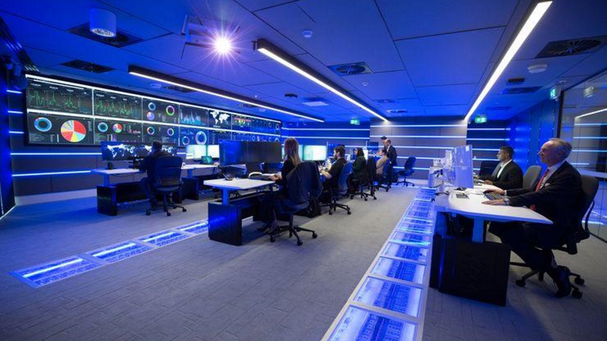

After the short experience in Software Development, I took another challenge. Yes, the opportunity of reaching to a new path of Information Security that I've always wanted to be part of. As I did with the brief blog of SoftDev now is the time of my first month at SOC:

The first day, I was very nervous with lots of expectations of what I'm going to do. I was aware that I was going to work with SIEMs, AVs consoles, and bunch tools. As, I always do, I arrived very early to the building. I didn't spend too much time waiting for my introduction to the whole company.

After the introduction, I signed the contracts for my benefits and responsibilities. Also for the famous NDAs that I always hear of some Security Researchers. Then, the moment I was waiting for... Get to the SOC, and there it was:

Many screens showing SIEMs, status websites uptime, support tickets, current threats, and more. I felt that I was in the place I always wanted to work. At first, I stared at the monitors seeing how the events were updating each minute. Support team were preparing my equipment and installing the necessary tools.

Then, we started the necessary training material for getting prepared. The instructor also taught us the many internal tools of the company. After receiving the material, I got a huge screen for better visibility of the tools. Also, because the laptop screen is kinda small compared to a big screen.

I've mentioned the commodities so far, and you are wondering: where's the security? ISO 27001 is the way to go. The standard defines the what, and whatnot. It's very flexible to meet all the security companies requirements. No photos, no backpacks, no cup of coffee nearby your equipment. For others felt very repressive, for me its general rules of a company. I've worked before on a call center and it was worse compared to this.

## Let's get technical

Many miscomprehend the generalities of the ISO 27001. It is not a standard that you need to meet every rule. What you need is establish context, scope, and objectives. The standard will adapt to your needs, and I will leave this topic for another day.

What about Confidentiality, Integrity and Availability? The CIA triad is everywhere, and many times Confidentiality takes a bigger importance. Sometimes is Availability and other times is Integrity. It will depend on the goal of the client or the process. In the company manual mentions that protecting the triad is a goal that the SOC Analyst needs to achieve.

SIEMs? OK now first thing. There lots of logs, everywhere. For once I'm glad these tools exist, because it would be a daunting task of collecting them all day long. Not only of collecting is hard, but making the proper cleanup is even worse. The data doesn't come in an spreadsheet, with nice ordered columns, or with dynamic tables. It comes in the form of a long string.

A simple example of logs:

92.168.72.177 - - \[22/Dec/2002:23:32:15 -0400] "GET /style.css HTTP/1.1" 200 4138 www.yahoo.com "https://www.yahoo.com/index.html" "Mozilla/5.0 (Windows..." "-"

192.168.72.177 - - \[22/Dec/2002:23:32:16 -0400] "GET /js/ads.js HTTP/1.1" 200 10229 www.yahoo.com "http://www.search.com/index.html" "Mozilla/5.0 (Windows..." "-"

192.168.72.177 - - \[22/Dec/2002:23:32:19 -0400] "GET /search.php HTTP/1.1" 400 1997 www.yahoo.com "-" "Mozilla/4.0 (compatible; MSIE 6.0; Windows NT 5.1; ...)" "-"

64.242.88.10 - - \[07/Mar/2004:16:45:56 -0800] "GET /twiki/bin/attach/Main/PostfixCommands HTTP/1.1" 401 12846

64.242.88.10 - - \[07/Mar/2004:16:47:12 -0800] "GET /robots.txt HTTP/1.1" 200 68

SIEMs? OK now first thing. There lots of logs, everywhere. For once I'm glad these tools exist, because it would be a daunting task of collecting them all day long. Not only of collecting is hard, but making the proper cleanup is even worse. The data doesn't come in an spreadsheet, with nice ordered columns, or with dynamic tables. It comes in the form of a long string.

You might think: "OK I can put the dates in a column and setup the other request in another", that will take too much time. SIEMs ease the collection and enrichment of the logs to give relevant information. It can show if an event is suspicious or needs further investigation. It makes pivoting easier. Because you can filter suspicious IP address to other events that are relevant.

What I'm trying to say is that for a SOC Analyst, time is gold. Efficiency is imperative, meaning if you can ease any process, it will help you to take down other events. Tools will become your allies and you will depend of them. That's why when the SIEMs starts to slow down is PANIC!

I'm enjoying my time at the Security Operations Center, and I will discuss about more topics in the future.