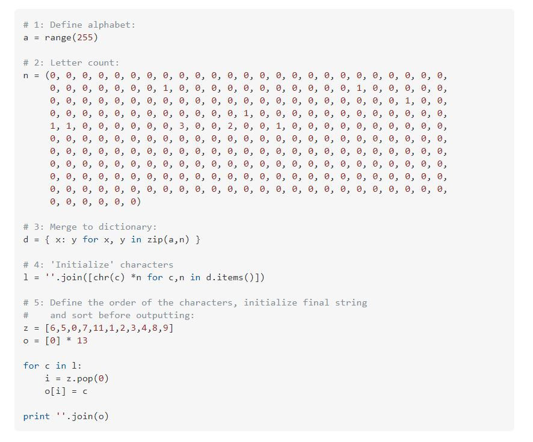

It's the third month that I've been working at CodeExitos as a Software Developer. It's the first job that is related to my career, meaning that every single hour of learning and learning finally would lead me to success, right!? I mean finally I’m here and I’m coding several lines of code that displays an image or a text or a button, so no more hurdles, right? Well, I’m going to share the experience in these three months and there are no complains about work culture, in fact that something I’m going to share in another post! 

## Welcome to Tech. Inc

Ah, receiving that email that you were waiting for months, if not months probably a year, with the subject: Job Offer. It’s finally over, no more LinkedIn daily search, no more learning job interview tips, no more practicing for another interview and dressing up for a formal or a wedding. The long journey of the job hunting is now concluding with a happy ending and even the credits are showing up. 

For me it was an euphoric moment, but then many thoughts were rambling in my head about, what to do with my first paycheck, should I write a blog post (like this one) telling how I got here, what I should be learning right now before my first day, and the most important, what is going to happen on my first day at my new job?  At work I finished speaking with my boss and I thought: “Alright time to go to rest a bit”. Meanwhile at work they were setting up the accounts, permissions, meetings, and meetings. Meetings? I’ve got a new meeting, after the accepting the contract, to tell me about the workflow, the tools, and more. 

My first reaction was: “ALERT! Panic! Wait I’m not yet mentally prepared!” Although when you accept that contract you are now ready. The meeting started, my boss was explaining about the workflow, where to find information related to the company, and about the project that I’m going to work for the following months. I’m glad that I know some of the tools for the design and for the teamwork collaboration, although as soon I started to see the many things that I need to achieve in the following weeks, I started to panic! The meeting ended, they share many articles to set up my development environment and helped me during the process of installation. At this moment, I took the decision of learning everything of this development and practice during the weekend (I accepted the job on Friday).

## “Hello World”? 

([Source of image](https://codegolf.stackexchange.com/questions/4838/most-complex-hello-world-program-you-can-justify))

Yes, this block of code is just to print a “Hello World” on the screen. I’m exaggerating on the statement because that’s what I was seeing the first day at job with the many lines of code. There were many things I could recognize that I was confident with, but that was the 20% of the entire project. What’s Redux? What’s Amplify? Why I’m having null errors? What in the world is a Saga? I don’t get it, what do I do? Sprint planning? Alright Git, what do you mean by CR? PR? Where I am? 
I’m not going to technicalities because it’s not the point of the post but rather you might get the picture. I was seeing the same way that long block of code that was just printing “Hello World”. I was completely lost, during the first week my performance was very low. My coworker told me: “Do you need help?” and we regularly made some meetings for pair programming, but I was lacking something, very important for any job.

## S.O.S! I'm Sinking in The Tar Pit

Yes, of course, I need help to understand all these new tools, new concepts, etc. Easy, right? Learn everything read and read, try some stuff, google it, and perhaps do some stack overflow. But, what do you do when the code isn’t the same as that question in StackOverflow? How do you understand someone else’s code? 

Exactly you go and you ask for help! Even though the solution was simple, my problem is to make the first step and asking it when I’m stuck. Frederick Brooks describes in his essay The Mythical Month Man: “…programming has over the past decade been such a tar pit, and many great and powerful beasts have thrashed violently in it.” In other words, programming can become a tar pit, where the more you fight it, the deeper you sink. Happens many times, as the project grows, changes on requirements, bugs that arises, and many other woes of programming that can demotivate any programmer, and even more if you are starting working.

Asking for help is not optional, is imperative. For me that I’m quite shy and a little prideful, it’s such a difficult task, because of these thoughts in my head: 

1. “What if they think that I’m really dumb for asking this question and not getting the solution by myself?”
2. No, maybe there are busy and I’m going to bother them. 

Both are dangerous and bad thoughts. They hindered my learning process of the workflow and I struggled with many codes of block that I could simply ask what it was doing and why it was the best way to approach it. As any other first job, you want to be exceptional, innovative and helpful, but you reach the challenges and struggle to put aside your expectations and ask for the help you need. Communication, communication, communication, can really help to avoid big troubles. If not, you can see what happened at Tower of Babel.